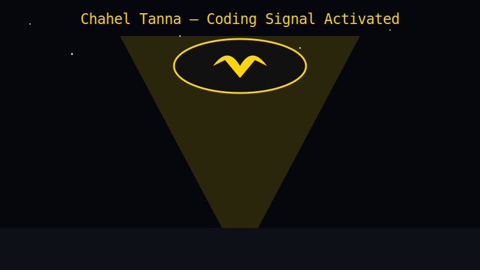
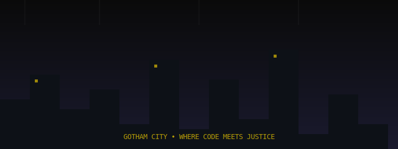

<!-- CUSTOM BAT-SIGNAL HEADER -->

  

<!-- SPINNING BATMAN LOGO -->

  

<!-- STATUS BADGES -->

---

## 🦇 IDENTITY CONFIRMED

> **Subject:** Chahel Tanna  
> **Role:** Full Stack Developer & Computer Science Engineer  
> **Location:** Ahmedabad, Gujarat, India  
> **Directive:** Building scalable products, clean APIs, and fast UIs.

I don't just write code — I craft **digital justice**. Specializing in the **MERN Stack**, I build high-performance applications that serve the greater good.

---

## 🛠️ THE UTILITY BELT (Tech Stack)

### 🎨 **Frontend**

### ⚙️ **Backend & APIs**

### ☁️ **Cloud & DevOps**

### 🔧 **Tools**

---

### 🔧 **Tools & Environment**

  

`Git` • `GitHub` • `VS Code` • `Postman` • `npm`

---

## 📂 CLASSIFIED CASE FILES

<table>
  <tr>
    <td width="50%">
      <h3>🔦 <a href="https://github.com/chahel1817/VivaMate">PROJECT: VIVAMATE</a></h3>
      
<strong>Clearance Level:</strong> TOP SECRET

      
An AI-powered interrogation unit (Interview Simulator) designed to test the resolve of recruits.

      
<code>MERN Stack</code> <code>OpenRouter AI</code> <code>WebRTC</code> <code>Real-time Analysis</code>

    </td>
    <td width="50%">
      <h3>🎯 <a href="https://github.com/chahel1817/EduTrack">PROJECT: EDUTRACK</a></h3>
      
<strong>Clearance Level:</strong> RESTRICTED

      
A tactical performance monitoring system for tracking skill acquisition and field readiness.

      
<code>Node.js</code> <code>MongoDB</code> <code>REST Analytics</code> <code>Progress Tracking</code>

    </td>
  </tr>
</table>

---

## 🧠 GOTHAM ANALYTICS (GitHub Stats)

<!-- Using GitHub Profile Summary Cards instead -->

  

<!-- Streak (this works) -->

---

<!-- GOTHAM SKYLINE -->

  

---

## 📡 SIGNAL THE BAT

**Encrypted Channels:**

---

  

